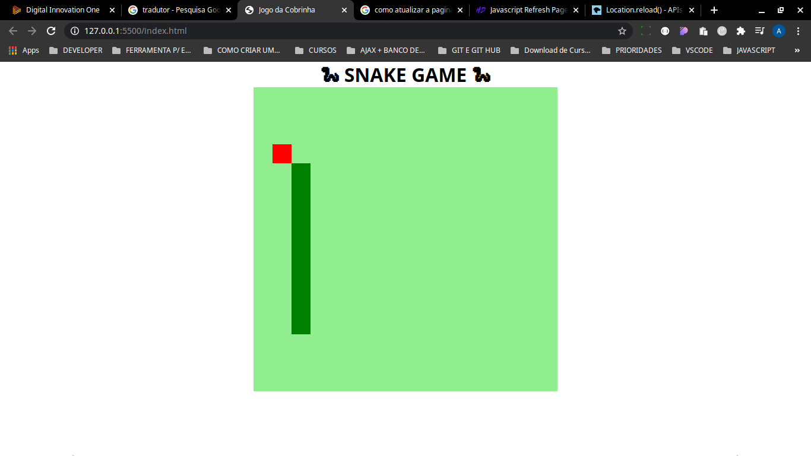

<h1 align="center">

:computer: **PROJETO JOGO DA COBRINHA**

</h1>

<h1 align="center">

</h1>

<h2 align="center" style="color:black"> Layout do Projeto Concluído
<h2>

<h2 align="center">

</h2>

<p align="center">
    <a href="https://www.linkedin.com/in/antonio-stanislaw-dos-santos-47a077106/">
        
    </a>
    <a href="LICENSE">
        
    </a>
</p>

<h5 align="center">
<p style="color:black">ÍNDICE</p>

[Sobre o desafio](#-Sobre-o-desafio) | [Tecnologias utilizadas](#-Tecnologias-Utilizadas) | [Como baixar o projeto](#-Como-baixar-o-projeto) | [Licença](#-Licença) | [Autor](#-Autor)

</h5>

## 🚀 Sobre o desafio

Desafio feito no Bootcamp de **HTML Web Developer**, que consiste na recriação do jgo da cobrinha, envolvendo o conteúdo estudado durante o Bootcamp.

Nesse projeto foi recriado o famoso jogo da cobrinha utilizando o **HTML5**, **CSS3** e **JavaScript**, entre outros contéudos.

## 🛠️ Tecnologias Utilizadas

- HTML5;
- CSS3;
- JavaScript

## ⏬ Como baixar o projeto
- <b style="color:red"> OBS: </b> É necessário ter o git instalado em sua máquina
- Executar o Seguinte comando no seu **Terminal** ou no **CMD**:

```bash
        git clone https://github.com/stanislawiaw2018/projeto-jogo-da-cobrinha-Digital-Innovation-One.git


```

---

## ⌨️ Autor

<br>
<sub><b>Antonio Stanislaw</b></sub>

:rocket: Exercício resolvido com muita dedicação e esforço por [Antonio Stanislaw](https://www.linkedin.com/in/antonio-stanislaw-dos-santos-47a077106/) :man_technologist:

##### Contatos
[](mailto:stanislaw.iaw2018@gmail.com)&nbsp;[](https://www.linkedin.com/in/antonio-stanislaw-dos-santos-47a077106/)